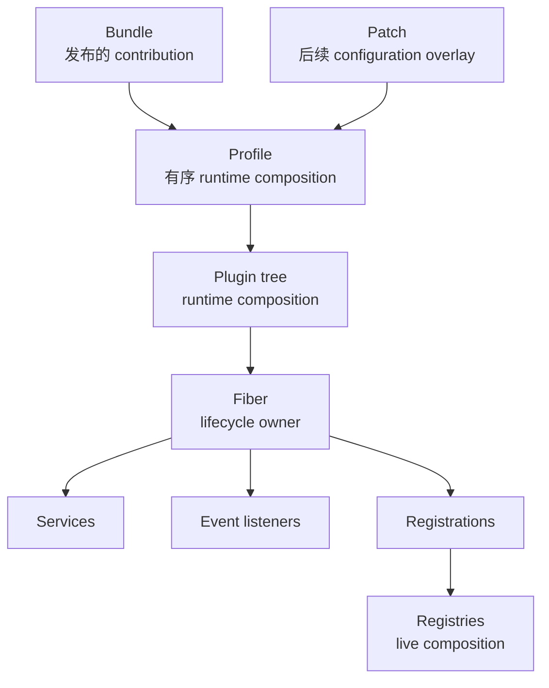
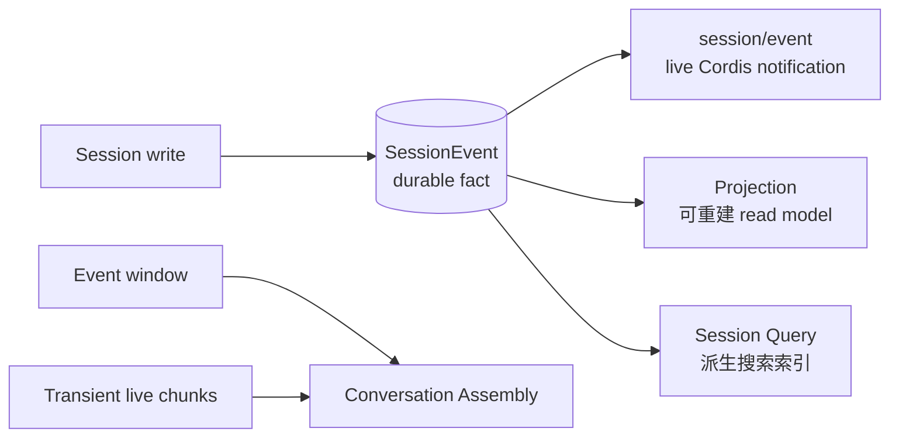
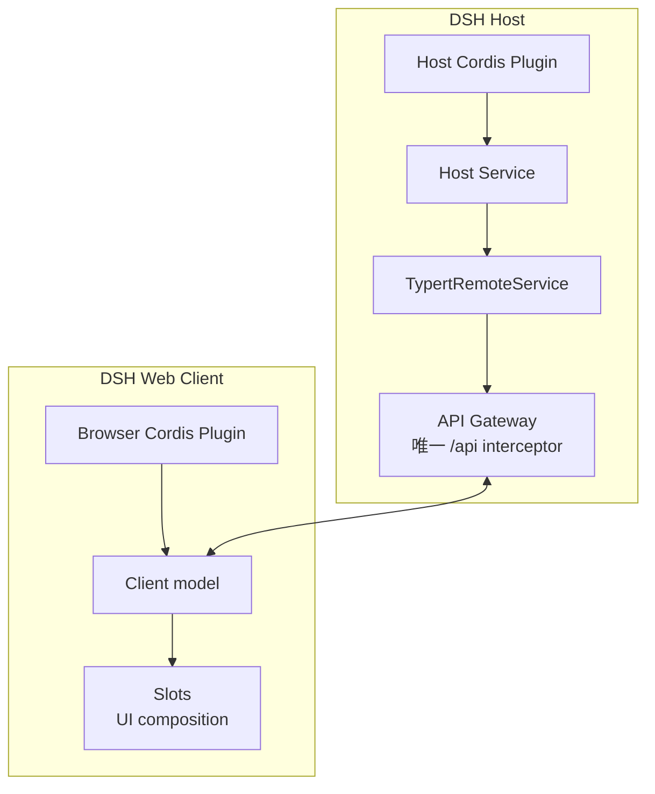

# DSH/Cordis 规范 Context

在 plan、PRD、ADR、代码与 review 中使用这些 leading words。每个术语只命名一个边界；不要因为另一个词听起来熟悉就互相替换。

## 来源标签

- **DSH-native** — 存在于固定版本 DeepSeek Harness 源码/API 中。
- **Cordis-native** — 存在于 DSH 所使用的 Cordis framework 中。
- **application-defined** — 下游产品或 Plugin 自己定义的概念，不属于固定版本的 DSH/Cordis contract。
- **durable** — 进程退出后仍能从持久化记录恢复。
- **live/process-local** — 只存在于当前 runtime。

写设计时必须显式标记 application-defined API。否则下游的 `ctx.<name>` 会被误读成上游已经保证的能力。

## Runtime composition

### Plugin 与 Fiber

- **Plugin** — 运行时 feature module 与生命周期容器。它可以提供 Service、监听 Event、增加 Registration、创建 child Plugin，也可以完全不提供 Service。
- **Fiber** — 一个 live Plugin instance 及其 lifecycle ownership。Fiber dispose 时，它拥有的 effect 与 Registration 会被撤销。

```text
Plugin != ctx.<service>
Plugin = lifecycle + services + listeners + registrations + effects + children
```

### Bundle、Profile、Patch

- **Bundle** — 一个 package 通过 `dsh.bundle` manifest 与配置层贡献的内容。
- **Profile** — 用户启动的、有顺序的 runtime composition。
- **Patch** — 后续插入或覆盖 Loader row 的配置 overlay。

```text
Bundle = published contribution
Profile = launched composition
Patch = overlay
```

Profile 不是浏览器 profile、用户身份、cookie jar 或 Session 隔离边界。后应用的 Patch 会整对象替换 row 的 `config`。

### 三层 composition

```text
Profile / Bundles    -> 启动哪些 feature package
Plugin tree / Fibers -> 谁拥有 runtime lifecycle
Registries           -> 当前有哪些 live contribution
```

Agent Scope 主要作用于 Registration，而不是 Profile composition。



Profile 决定加载什么，Fiber 拥有什么 live contribution，Registry 决定当前可以使用哪些 contribution。

## Capability seam

### Service Definition、Provider、Consumer

- **Service Definition** — 稳定的 command/query contract：method、input、output、error 与 cancellation semantics。
- **Provider** — Service Definition 的具体实现，例如 local、remote 或 container Shell。
- **Consumer** — Service 的调用方：Tool、Event listener、route/UI adapter、Scheduler/Job 或另一个 Service。
- **Capability seam** — `Consumer -> Service Definition -> Provider`。

**Service** 指通过 `ctx.<name>` 使用的稳定 capability API，不是碰巧提供它的 Plugin。

```text
Tool != Service
Tool = model-facing Consumer
```

改变 capability 的执行位置，意味着替换 Provider，同时保持 Definition 与 Consumer 不变。

## Registry、Registration 与 scope

- **Registry** — 一种通用 pattern：live entry，加上 lookup、precedence、ownership 与 lifecycle。Tool、Skill Provider、System Prompt Section、UI Slot 与 Workspace registry 都是例子。
- **Registration** — 一个 Plugin 向 Registry 提供的一项 runtime contribution。
- **Agent Scope** — scope-aware Registry 的 visibility rule：一个 Agent 能看到哪些 Registration。
- **Service Isolation（Realm）** — dependency-resolution boundary：一个 context subtree 会解析到哪个同名 Service instance。

`Registry` 是通用模式；`ctx.registry` 特指 Cordis Plugin Registry。

```text
Agent Scope       = 这个 Agent 能看到哪些 registration
Service Isolation = 这个 context 会解析到哪个 Service instance
```

两个轴相互独立。只有实现了 scoped resolution 的 subsystem 才会遵守 Agent Scope。

## Cordis Event

**Cordis Event** 是 process-local notification、interception 或 lifecycle coordination。Service call 不会自动变成 Event。

| Dispatch mode | Contract | 常见用途 |
| --- | --- | --- |
| `emit` | 同步广播；不等待 listener 返回的 Promise | fire-and-forget 状态通知 |
| `parallel` | 并发运行 listener；等待全部 settle | 彼此独立但必须完成的准备工作 |
| `serial` | 按顺序等待 listener；可以 bail | 有顺序的处理 |
| `bail` | dispatcher 依次尝试，直到某个 listener claim | handler/Provider 选择 |
| `waterfall` | listener 调用 `next()` 继续，并可包裹或 veto | policy、approval、rewrite |

在 **bail** 中，由 dispatcher 推进。在 **waterfall** 中，由当前 listener 调用 `next()` 推进。

## Session：事实与派生视图

- **Agent** — 关联到一个 Session 的 live DSH executor；它是 runtime object，不是 durable product identity。
- **AgentHandle** — Agent create/resume 返回的 lifecycle capability；其 owner 可以 stop、drain、dispose 该 live Agent。
- **Subagent** — 通过 DSH Subagent capability 在 parent Agent 工作内部创建的 delegated child Agent 与 child Session。
- **Agent Inbox** — live delivery queue，控制选定 input 在哪个 Agent Turn 或 Step boundary 进入执行。
- **SessionEvent** — DSH Session 中 typed、append-only、durable 的事实。Session log 是 Agent execution history 的 canonical source。
- **`session/event`** — SessionEvent commit 后发出的 live Cordis Event。
- **Projection** — 从 SessionEvent history 可重建地 fold 出当前 read model。
- **Session Persistence** — canonical durable Session log 的 Provider，例如 JSONL。
- **Session Query** — Session history 的派生搜索索引，例如 SQLite FTS。
- **Conversation Assembly** — 把 durable event window 与 transient live chunk 组合成与 target 无关的 presentation node，供 Chat/Trajectory renderer 使用。

```text
SessionEvent[] + reducer -> Projection
event window + transient -> Conversation Assembly
```

SessionEvent 不是逐帧 UI bus。Projection 与 Session Query 也不是新的事实来源。



SessionEvent log 是 authority；notification、projection、index 与 presentation 都是 consumer 或 derived view。

## Execution 与 storage

- **Execution World** — 程序运行的位置：local OS、container、remote host、microVM 或 cloud sandbox。
- **Sandbox** — 当前的 `ctx.sandbox` 限制同一 Execution World 内 subprocess 的 filesystem effect。不同的 Execution World 是 sibling Provider，不是 Sandbox mode。
- **Shell** — 命令式 Service，例如 `ctx.shell`。
- **Subprocess** — argv/process primitive，例如 `ctx.subprocess`；它不是 shell command string。
- **Job** — 有 identity，并支持 status/collect/stop lifecycle 的长时工作。
- **Terminal/PTY** — 带 controlling terminal 的交互式进程。
- **Schedule** — 未来的 delivery time；不是正在运行的 Job。
- **Spill** — 为过大的 Tool Result 提供外部存储，只在 model context 中留下 preview/locator。
- **Storage Domain** — 可路由到 JSON/SQLite 的 typed、non-Session 产品数据。它不是通用 ORM，也不是 Session Persistence。

```text
bash Tool -> Shell Service -> Shell Provider -> Subprocess Service -> Provider -> OS
```

## Host/client 边界

- **Slots** — 浏览器 UI composition seam。`single`、`list`、`keyed`、`chain` 编码冲突或共存规则。
- **Typert** — Host/client call 使用的 typed remote Service protocol 与 registry。
- **API Gateway** — `/api` interceptor 的唯一 owner；它负责 claim Typert endpoint。

浏览器是独立的 Cordis application。Client Plugin 不能注入 Host Service。Remote method 应通过由 API Gateway claim 的 `TypertRemoteService` 暴露；再次注册 `connection.rpc.intercept('/api', …)` 会遮蔽原生 API。



通过 Typert/API Gateway 跨越 Host/client 边界，再通过 Slots 组合浏览器 UI。

## 一句话模型

> Plugin 是 lifecycle container；Service 是 capability entrance；Provider 是实现；Consumer 使用它；Cordis Event 协调 live reaction；Registry 组合 runtime entry；Registration 是其中一项；SessionEvent 是 durable truth；Projection 是可重建的 read model；Bundle/Profile/Patch 决定加载哪些 Plugin。
